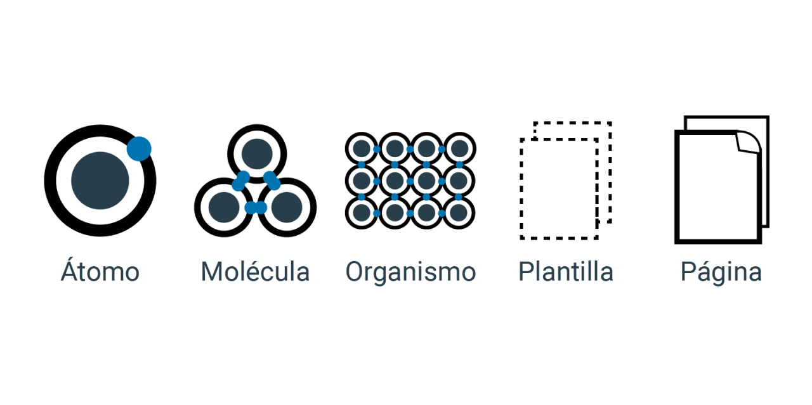

## Designer Atomic
O Designer Atomic é uma metodologia de design que quebra a interface do usuário em partes menores e mais simples, chamadas de átomos, que são combinadas para formar componentes mais complexos, conhecidos como moléculas, organismos, templates e páginas. Esta abordagem promove a reutilização de código e ajuda a criar interfaces consistentes e escaláveis.

### Histórico
O Designer Atomic foi introduzido por Brad Frost em 2013, em seu livro "Atomic Design". Desde então, tem sido amplamente adotado na indústria de design e desenvolvimento web como uma maneira eficaz de organizar e estruturar interfaces de usuário.

## Conceitos Principais
### Átomos
Os átomos são os blocos de construção mais básicos de uma interface de usuário, como botões, inputs, textos, etc. Eles não podem ser divididos em partes menores sem perder sua funcionalidade.

### Moléculas
As moléculas são grupos de átomos que trabalham juntos para formar componentes mais simples e reutilizáveis, como formulários, barras de navegação, etc.

### Organismos
Os organismos são conjuntos de moléculas e/ou átomos que formam componentes mais complexos e completos, como cabeçalhos, rodapés, barras laterais, etc.

### Templates
Os templates são layouts completos que combinam diferentes organismos para criar estruturas de página consistentes.

### Páginas
As páginas são instâncias específicas de templates, preenchidas com conteúdo real e usadas para apresentar informações aos usuários finais.

## Vantagens do Designer Atomic
Reutilização de Código: A abordagem atômica promove a reutilização de átomos, moléculas e organismos em diferentes partes da aplicação, reduzindo a duplicação de código e facilitando a manutenção.

Consistência de Design: Ao criar componentes modulares e reutilizáveis, o Designer Atomic ajuda a garantir uma aparência consistente em toda a aplicação.

## Escalabilidade:
 A estrutura hierárquica do Designer Atomic permite que as equipes dimensionem suas aplicações de forma mais eficiente, adicionando novos componentes conforme necessário sem comprometer a consistência ou a qualidade do design.

## Facilidade de Teste e Manutenção: 
Com componentes bem definidos e isolados, é mais fácil testar e fazer atualizações em partes específicas da aplicação, sem afetar outras áreas.

## Compartilhamento e Colaboração: 
As bibliotecas de componentes baseadas em Designer Atomic facilitam o compartilhamento e a colaboração entre equipes de design e desenvolvimento, promovendo a consistência e a eficiência em todo o projeto.

Para mais informações sobre o Designer Atomic, consulte o livro "Atomic Design" de Brad Frost e explore as práticas recomendadas e exemplos disponíveis online.


```
js/
|-- components/
|   |-- atoms/         # Diretório para componentes atomicos
|   |   |-- button.js
|   |   |-- input.js
|   |   |-- form.js
|   |   |-- label.js
|   |   |-- ...
|   |
|   |-- molecules/      # Diretório para componentes moleculares
|   |   |-- botoesFooter.js
|   |   |-- formulario.js
|   |   |-- navlinks.js
|   |
|   |-- organisms/       # Diretório para componentes orgânicos
|   |   |-- footer.js
|   |   |-- header.js
|   |   |-- main.js
|   |   |-- navbar.js
|   |   |-- sidebar.js
|   |   |-- ...
|   |
|   |-- templates/       # Diretório para templates
|       |-- MainLayout.js
|       |-- TemplateSobre.js
|
|-- pages/               # Novo diretório para páginas da aplicação
|   |-- contato.js       # Página contato fictícia
|   |-- home.js          # Página "home" fictícia
|   |-- sobre.js         # Página "Sobre" fictícia
|
|-- utils/
|   |-- api.js           # não criado
|
|-- styles/
    |-- styles.css
    |-- variables.css
```
